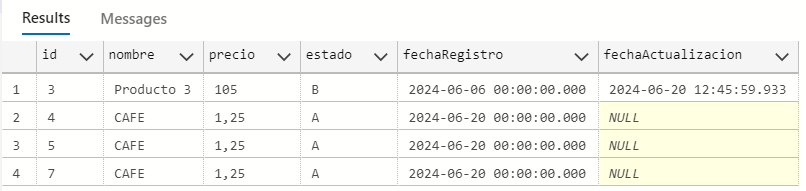

## 👉TALLER MICROSERVICIO PRODUCTO USANDO - JdbcTemplate 💪✔️
### 1. Descripción
Este proyecto es una aplicación de gestión de productos que permite realizar operaciones básicas como agregar, actualizar, eliminar y ver productos en una base de datos.
### 2. Herramientas
Este proyecto esta desarrollado bajo las siguientes herramientas:
- Spring boot versión: 3.2.3
- Java JDK versión:17
- Apache Maven  versió: 3.3.9
- Base de datos SqlServer 

### 3. Configuración
- POM:
```
<!-- https://mvnrepository.com/artifact/com.microsoft.sqlserver/sqljdbc4 -->
		<dependency>
			<groupId>com.microsoft.sqlserver</groupId>
			<artifactId>mssql-jdbc</artifactId>
			<version>9.4.1.jre11</version> <!-- Verifica y usa la última versión disponible -->
		</dependency>

		<dependency>
			<groupId>org.springframework.boot</groupId>
			<artifactId>spring-boot-starter-data-jdbc</artifactId>
		</dependency>
```
### 4. Base de datos
- Secuencia:
```
CREATE SEQUENCE ProductoSequence
    START WITH 1
    INCREMENT BY 1;
    
SELECT NEXT VALUE FOR ProductoSequence
```

- Tabla:
```
CREATE TABLE Producto (
id INT PRIMARY KEY,
nombre VARCHAR(100),
precio FLOAT,
estado VARCHAR(1),
fechaRegistro DATE,
fechaActualizacion DATE
);
```
- Insertar:
```
select * from  Producto;
INSERT INTO Producto (id, nombre, precio, estado, fechaRegistro,fechaActualizacion) 
VALUES (1, 'Producto 1', 10.99, 'A', '2024-06-04','');
```


### 3. EndPoint
- Registrar:
```
[POST]
http://localhost:8080/api/v1/mantenimiento/producto-service/registrar
 
 {
    "nombre":"CAFE",
    "precio":"1.25"
}
```
- Listar:
```
[PUT]
http://localhost:8080/api/v1/mantenimiento/producto-service/listadoProductos
```
- Actualizar:
```
[PUT]
 http://localhost:8080/api/v1/mantenimiento/producto-service/update
 
 {
"id":3,
"precio":"105"
}

```
- Eliminar
```
[PUT]
 http://localhost:8080/api/v1/mantenimiento/producto-service/delete
 
 {
"id":8
}
```

# 🚧🚨ATENCIÓN:⛔
# 🔧🔨🕜 ⚙ 👉 leviDev trabajando...

## Autor:
<span style="color:DodgerBlue">**Leonardo Villagran**</span> | <span style="color:yellow">**le**</span><span style="color:DodgerBlue">**vi**</span><span style="color:red">**Dev**</span>

- [LinkedIn] https://www.linkedin.com/in/lvillagrans